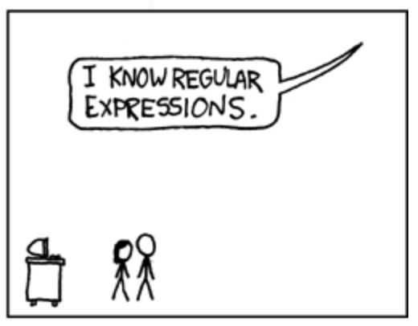

footer: WebCamp(**@arkh4m**)
build-lists: true
theme: Fira, 6
[.text: alignment(left)]

[.header: text-scale(0.9)]

# How to teach your computer to play guitar


---

[.text: alignment(center)]

# Hello! 🐒

---

## My name is Ju 🙇🏻‍♂️

---

## I like to play the 🎸

---

## But I'm not very<br>good at it 🙉

---

## So I have to look up<br> songs on the 🕸

---

## But those 🕸 are dark<br>and full of 🙀

---

🎶 🎵 🎶

**[Am]** Hello darkness, my old **[G]**friend,
I've come to talk with you **[Am]**again,
Because a regex soft**[F]**ly cree**[C]**ping,
Left its seeds while I **[F]**was slee**[C]**ping,
The **[F]**revision that was planted in
**[C]**git blame, still remains**[C]** **[Am]**
**[C]**Within the **[G]**sound of **[Am]**silence.

---


---

## _Fine_, I'll do it myself

---

🎶 🎵 🎶

**[Am]** Hello darkness, my old **[G]**friend,
I've come to talk with you **[Am]**again,
Because a regex soft**[F]**ly cree**[C]**ping,
Left its seeds while I **[F]**was slee**[C]**ping,
The **[F]**revision that was planted in
**[C]**git blame, still remains**[C]** **[Am]**
**[C]**Within the **[G]**sound of **[Am]**silence.

---

# CODING TIME

---

## A simple Elm application

---

## A simple Elm application, Pt I

```elm
module Main exposing (main)

import Browser
import Html exposing (Html)
import Html.Attributes as Attr

type alias Model =
    {}

type Msg
    = NoOp
```

---

## A simple Elm application, Pt II

```elm
main : Program () Model Msg
main =
    Browser.element
        { init = \_ -> ( {}, Cmd.none )
        , view = view
        , update = update
        , subscriptions = \_ -> Sub.none
        }
```

---

## A simple Elm application, Pt III

```elm
view : Model -> Html Msg
view model =
    Html.div []
        [ Html.text "Hello world!" ]

update : Msg -> Model -> ( Model, Cmd Msg )
update msg model =
    case msg of
        NoOp ->
            ( model, Cmd.none )
```

---

## Parsing a blurb of text?

---



[.footer: [xkcd.com/208](https://xkcd.com/208/)]

---

## /**\\[[ABCDEFG]m?\\]**/

---

## This regex finds chords

---

## But it only<br>understands text

---

## It doesn't _really_<br>understands chords

---

## String **->** [Chord]

---

## String **->** [String]

---

## 😥

---

## 😥[^*]

[^*]: disappointed_but_relieved_face

---

## Let's use Elm<br>and [**elm/parser**](https://github.com/elm/parser)

---

## Wishful Programming™[^•]

[^•]: Not actually trademark

---

# A Note

```elm
type Note
    = A
    | C
    | F
    | G
```

---

# A Chord

```elm
type Chord =
    Chord Note
```

---

# A Chord, Pt II

[.code-highlight: 1-4][.code-highlight: 1-7]

```elm
type Quality
    = Major
    | Minor
    | Dominant7

type Chord
    = Chord Note Quality
```

---

## But we still need<br>to parse the text!

---

## Let's build a parser

---

[.code-highlight: 1-1][.code-highlight: 1-3]

```elm
import Parser exposing (Parser)

chordParser : Parser ???
chordParser =
    ???
```

---

[.code-highlight: 1-3][.code-highlight: 1-5]

```elm
import Parser exposing (Parser)

chordParser : Parser Chord
chordParser =
    ???
```

---

## Wishful Programming™

---

[.code-highlight: 1-1][.code-highlight: 1-5]
[.code-highlight: 1-6][.code-highlight: 1-7]

```elm
import Parser exposing (Parser, (|=), (|.))

chordParser : Parser Chord
chordParser =
    Parser.succeed (\note quality -> Chord note quality)
    |= noteParser
    |= qualityParser
```

---

[.code-highlight: 1-2][.code-highlight: 1-3]
[.code-highlight: 1-5][.code-highlight: 1-14]

```elm
noteParser : Parser Note
noteParser =
    Parser.oneOf
        [ Parser.succeed A
            |. symbol "A"
        , Parser.succeed F
            |. symbol "F"
        , Parser.succeed G
            |. symbol "G"
        , Parser.succeed C
            |. symbol "C"
        ]
```

---

[.code-highlight: 1-2][.code-highlight: 1-3]
[.code-highlight: 1-5][.code-highlight: 1-7]
[.code-highlight: 1-9]

```elm
qualityParser : Parser Quality
qualityParser =
    Parser.oneOf
        [ Parser.succeed Minor
            |. symbol "m"
        , Parser.succeed Dominant7
            |. symbol "7"
        , Parser.succeed Major
        ]
```

---

# Tada 🎉

```elm
import Parser exposing (Parser, (|=), (|.))

chordParser : Parser Chord
chordParser =
    Parser.succeed (\note quality -> Chord note quality)
    |= noteParser
    |= qualityParser
```

---

# Tada 🎉

```elm
import Parser exposing (Parser, (|=), (|.))

chordParser : Parser Chord
chordParser =
    Parser.succeed (\note quality -> Chord note quality)
    |. symbol "["
    |= noteParser
    |= qualityParser
    |. symbol "]"
```

---

## Now we really know<br>what the chords are!

---

[.list: alignment(left)]

# What can we do with that

- Figure out which notes compose a chord
- Build a guitar fretboard in Elm
- Choose chords that are nice to play
- Build SVG charts of such chords
- All of this on the fly! Nothing hardcoded!

---

# LIVE DEMO 🎸

---

# Thank you!

**CODE**
[github.com/Arkham/elm-chords](https://github.com/Arkham/elm-chords)
[github.com/Arkham/webcamp-2019](https://github.com/Arkham/webcamp-2019)

**DEMO**
[ellie-app.com/5wDzdJyjQ6Ca1](https://ellie-app.com/5wDzdJyjQ6Ca1)
[ellie-app.com/6HZqvnz8Py4a1](https://ellie-app.com/6HZqvnz8Py4a1)
